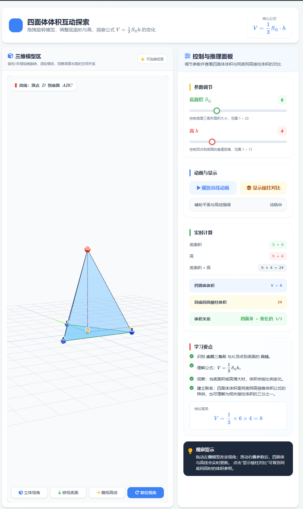
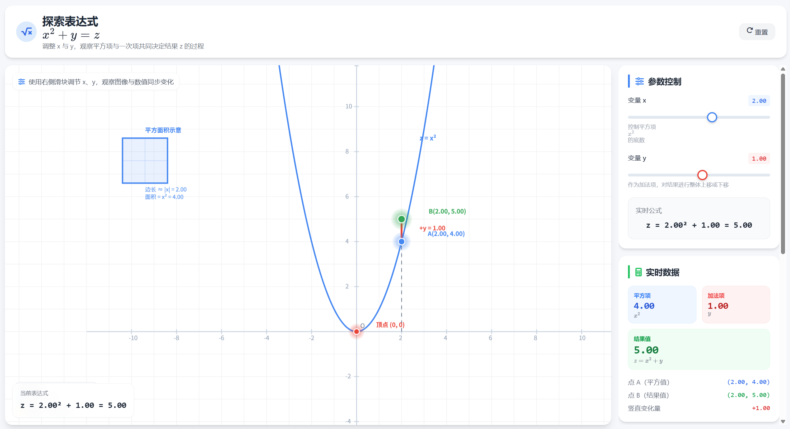

# AiEdTools - AI教育交互动画生成平台

<p align="center">
  
  
  
  
  
</p>

## 项目简介

**AiEdTools** 是基于大语言模型的智能教育交互式 HTML 动画生成平台。

用户只需输入任意知识点或题目，AI 即可自动生成包含 **Canvas 2D** / **Three.js 3D** / **SVG** 的高质量交互式教学 HTML 页面。平台深度覆盖**数学**（几何、代数、函数、微积分）与**物理**（力学、光学、电磁学）等多学科场景，让抽象知识变得直观可交互。

## 生成案例展示

<div align="center">
  
  
</div>

<p align="center"><em>左：四面体体积动态探究 &nbsp;&nbsp;|&nbsp;&nbsp; 右：数学公式可视化交互</em></p>

## 核心特性

- 🤖 **多模型智能降级** — Kimi → Qwen → DeepSeek → OpenAI，自动故障转移
- 📚 **25+ 参考案例库** — 内置高质量教学 HTML 模板，智能匹配引擎自动召回最相似案例
- 🎨 **三种渲染模式** — Canvas 2D / Three.js 3D / SVG，根据知识点自动选择最优渲染方案
- 📝 **四层提示词体系** — L1 系统角色 + L2 学科专项 + L3 场景类型 + L4 质量约束
- 🔄 **SSE 实时流式生成** — 逐步展示 AI 思考与生成过程，降低等待焦虑
- 🛡️ **内置安全防护** — MathJax 异步加载、CSS 容器高度防护、CDN 规范校验
- 📊 **全链路日志系统** — 分级日志（INFO / DEBUG），10MB 自动轮转，便于调试与审计

## 系统架构

```
用户输入 → 智能分析 → 提示词组装 → 多模型调用 → HTML生成 → 后处理 → 输出
                ↓              ↓
          学科/场景分类     参考案例智能匹配
```

**流程说明**：
1. **智能分析** — `SubjectAnalyzer` 识别学科与场景类型
2. **提示词组装** — `PromptManager` 按四层体系拼装提示词，并召回相似参考案例
3. **多模型调用** — `FallbackManager` 按优先级调用 AI，失败时自动降级
4. **HTML 生成** — `RuntimeEngine` 将 AI 输出注入模板，生成完整页面
5. **后处理** — `PostProcessor` 修复 MathJax、Three.js 等常见兼容问题
6. **输出交付** — 生成独立 HTML 文件，可直接在浏览器中打开运行

## 技术栈

| 层级 | 技术 |
|------|------|
| 后端框架 | Python 3.x, FastAPI, SSE (sse-starlette) |
| AI 模型 | Kimi, Qwen, DeepSeek, OpenAI (多模型降级) |
| 前端渲染 | Canvas 2D, Three.js, SVG, MathJax, Tailwind CSS |
| 提示词工程 | 四层体系 + DSL Schema + 参考案例库 |
| 配置管理 | pydantic-settings, python-dotenv |
| 日志系统 | Python logging + RotatingFileHandler |

## 项目结构

```
AiEdToolsH/
├── backend/
│   ├── app/
│   │   ├── api/                 # API 路由
│   │   │   ├── generate.py      # 主生成接口
│   │   │   ├── steps.py         # 分步生成接口
│   │   │   └── health.py        # 健康检查
│   │   ├── providers/           # AI 模型提供者
│   │   │   ├── kimi/            # Kimi (Moonshot)
│   │   │   ├── qwen/            # Qwen (通义千问)
│   │   │   ├── deepseek/        # DeepSeek
│   │   │   ├── openai_provider/ # OpenAI / GPT
│   │   │   └── fallback_manager.py  # 多模型降级管理
│   │   ├── prompts/             # 四层提示词体系
│   │   │   ├── system/          # L1 系统角色
│   │   │   ├── subjects/        # L2 学科专项 (math / physics / chemistry)
│   │   │   ├── scenes/          # L3 场景类型 (canvas / threejs / step_derivation)
│   │   │   ├── quality/         # L4 质量约束 (animation / interaction / style)
│   │   │   ├── examples/        # 参考案例库 (智能匹配)
│   │   │   ├── manager.py       # 提示词组装引擎
│   │   │   └── example_manager.py # 案例匹配引擎
│   │   ├── runtime/             # 运行时引擎
│   │   │   ├── engine.py        # HTML 渲染执行
│   │   │   ├── post_processor.py # 后处理修复
│   │   │   └── templates/       # 基础模板 (base / canvas2d / threejs)
│   │   ├── services/            # 核心服务
│   │   │   ├── orchestrator.py  # 生成流程编排器
│   │   │   ├── subject_analyzer.py # 学科/场景分析
│   │   │   └── html_extractor.py   # HTML 提取与清理
│   │   ├── dsl/                 # DSL 场景定义
│   │   │   ├── schema.py        # DSL Schema
│   │   │   ├── validator.py     # DSL 校验
│   │   │   └── scenes/          # 场景类型 (geometry_2d / geometry_3d / physics_mechanics / physics_optics)
│   │   ├── storage/             # 文件存储
│   │   │   └── outputs/         # 生成的 HTML 输出
│   │   ├── config.py            # 配置管理
│   │   └── main.py              # 应用入口
│   └── requirements.txt         # Python 依赖
├── frontend/                    # 前端页面
│   ├── index.html               # 首页
│   ├── generate.html            # 生成页面
│   ├── css/style.css            # 样式
│   └── js/                      # JS 逻辑 (api.js / app.js / generate.js)
├── 参考案例/                     # 25+ 高质量参考 HTML
├── logs/                        # 运行日志
└── .env.example                 # 环境变量模板
```

## 快速开始

```bash
# 1. 克隆项目
git clone https://github.com/OneOranger/AIEdTooLSh.git
cd AIEdTooLSh

# 2. 创建虚拟环境
python -m venv venv
venv\Scripts\activate  # Windows
# source venv/bin/activate  # Linux / macOS

# 3. 安装依赖
pip install -r backend/requirements.txt

# 4. 配置环境变量
copy .env.example .env  # Windows
# cp .env.example .env  # Linux / macOS
# 编辑 .env，填入各 AI 平台的 API Key

# 5. 启动服务
cd backend
python -m uvicorn app.main:app --host 0.0.0.0 --port 8000 --reload
```

服务启动后，访问 http://localhost:8000 即可使用前端界面。

## 配置说明

复制 `.env.example` 为 `.env`，配置以下关键项：

```bash
# 至少配置一个 AI Provider 的 API Key
KIMI_API_KEY=your_kimi_api_key_here       # Kimi (优先)
QWEN_API_KEY=your_qwen_api_key_here       # Qwen (第二)
DEEPSEEK_API_KEY=your_deepseek_api_key    # DeepSeek (第三)
OPENAI_API_KEY=your_openai_api_key        # OpenAI (最后降级)

# 服务器配置
HOST=0.0.0.0
PORT=8000
DEBUG=True
```

> ⚠️ **安全提示**：不要将包含真实 API Key 的 `.env` 文件提交到 Git 仓库。

## 参考案例覆盖范围

项目内置 **25+** 高质量参考案例，涵盖以下学科与题型：

**数学**
- 几何：勾股定理、四面体、圆与相似三角形、线段的垂直平分线、将军饮马问题
- 函数：三角函数、反比例函数、对数函数、指数函数、高斯函数、抛物线与焦点
- 代数：解一元二次方程、证明根号2是无理数
- 微积分：微积分探索
- 立体几何：圆锥体积推导、圆柱奥秘、圆锥曲线

**物理**
- 力学：伽利略的理想实验、平衡木与压敏电阻动态分析
- 光学：探究凸透镜成像
- 电磁学：磁场中的带电粒子临界问题

## License

本项目采用 [MIT License](LICENSE) 开源协议。

## 贡献与 Star

如果你认为这个项目有帮助，欢迎给它一颗 ⭐！

如有问题或建议，欢迎提交 Issue 或 Pull Request，一起让 AI 教育动画生成变得更强大。
